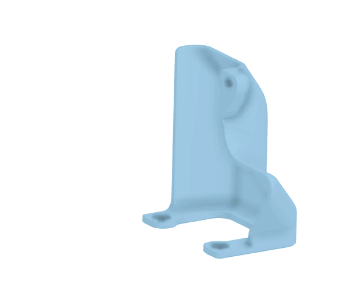

# Afterburner - Absolute Gigantic Connection Cover

I found standard [Afterburner cable connection cover](https://github.com/VoronDesign/Voron-Afterburner/blob/master/STLs/Gantry/Direct_Feed/%5Ba%5D_connector_cover_24SW.stl) way too small to fit all the connectors and cables. Also there was no space restrictions upwards or towards left, but on right side even few millimeters extra would cause connection cover to hit the cable chain bracket.

## Design

Copied the skrew holes and few other details from Voron standard, and then added lots of extra room to top and little to left side above the Afterburner. Added also small optional rear "door" to push the wires into the cover if they tend to push out.

Design can be found from OnShape online CAD: [link to CAD "file"](https://github.com/VoronDesign/Voron-Afterburner/tree/master/STLs/Gantry/Printheads)

The STL files:
- [Absolute_Gigantic_Connection_Cover.stl](Absolute_Gigantic_Connection_Cover.stl)
- [Absolute_Gigantic_Connection_Cover-Rear_Door.stl](Absolute_Gigantic_Connection_Cover-Rear_Door.stl)

And yes this is partially joke, but I'm not going to suffer from the standard, which has been designed too small.

## Comparison to standard part

Here is animated comparison of standard and Absolute Gigantic Connection Cover.

## How it looks in it's natural habitat?

